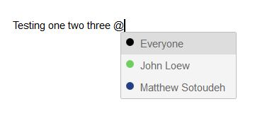
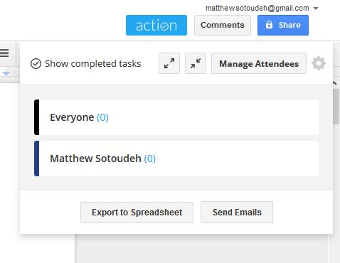
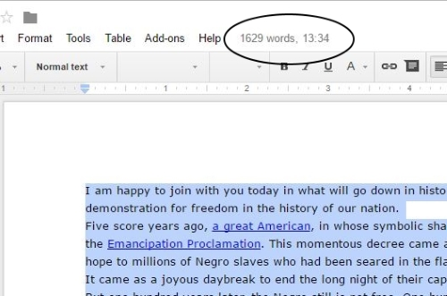

# docs-plus
A library for rich Google Docs extensions that can integrate with its editor.

[Skip to the Quickstart](#Quickstart)

# Screenshots
Docs+ allows you to interact with the user's text in the Google Docs Kix editor. A few screenshots of extensions using Docs+:

Rich interactions with the editor:



Adding custom buttons to Docs:



Using the user's selected text:



Interacting with Docs menus:


# Quickstart
First, include jQuery, docs.js, and utils.js in your project (ideally in that order). Then, start using the Docs+ library!

### Getting selected text
To get the user's currently selected text, use ``docs.getSelection``

```javascript
docs.getSelection(function (selection) {
    alert("You selected: " + selection);
});
```

If you'd like to default to returning the current text paragraph if there is no currently selected text, you can pass a parameter to the ``getSelection`` function:

```javascript
docs.getSelection(function (selection) {
    alert("You selected (or your insertion point is on): " + selection);
}, true);
```

If you run into issues with multi-line text (or text spanning across multiple bullet points), you can get the raw text selection element by passing a second 'true' parameter.

The following code calculates the time it would take to speak the currently selected text (see [speechless](https://github.com/matthewsot/speechless) for a full demo):

```javascript
docs.getSelection(function (textEl) {
    var text = "";
    $(textEl).children().each(function () {
        text = text.trim() + " " + $(this).text().trim();
    });
    text = text.trim().replace("\n", " ");

    var words = text.split(' ').length;
    var minutes = words / wordsPerMinute;
    var seconds = Math.round((minutes - Math.floor(minutes)) * 60);
    if (seconds.toString().length === 1) {
        seconds = "0" + seconds.toString();
    } else if (seconds.toString().length === 0) {
        seconds = "00";
    }

    var time = Math.floor(minutes) + ":" + seconds;

    $("#docs-notice").text(words + " words, " + time);
}, true, true);
```

### Inserting text
You can insert text at the current text insertion point using the ``docs.insertText(text)`` function.

```javascript
docs.insertText("Hello, World!");
```

### Other methods
There are numerous other methods in ``docs.js`` that you can use to interact with the editor:
* ``docs.getSelectionEl`` will return the raw selection highlight element from Docs
* ``docs.hasSelection`` will return whether the user has currently selected any text in Docs
* ``docs.backspace`` will delete the character directly before the user's insertion point
* ``docs.setColor`` will set the current text color. If I remember correctly, you should call it using ``docs.colors`` like so:
```javascript
docs.setColor($(docs.colors["gray"]));
```
* ``docs.toggleSubscript`` will toggle whether the text should be subscripted or not
* ``docs.getCurrentParagraphText(callback)`` will get the text of the paragraph which the user's insertion point is on
* ``docs.getUserCursor`` will return the raw element of the user's text insertion point

### Handling real-time editor input
``editor-input.js`` includes a number of helper functions to handle real-time editor input.

You can set up a handler for every time the user presses down a key in the editor:
```javascript
docs.keyboard.handleKeydown = function (e) {
    var chr = e.key; //"a", "b", etc.
}
```

Or, block mouse or keyboard inputs temporarily:
```javascript
docs.keyboard.startBlockingMouse();
docs.keyboard.startBlockingKeyboard();

docs.keyboard.stopBlockingMouse();
docs.keyboard.stopBlockingKeyboard();
```

This can be useful if when using in-text selectors that need to appear under the user's cursor, and you do not want to re-place those selectors when the user navigates to a different part of the document.

### Handling mouse events
There are currently no helpers for mouse events in Docs+, but you should hook into ``mouseup`` on ``.kix-appview-editor`` if you want to handle them. See the [speechless demo](https://github.com/matthewsot/speechless) for an example of this:

```javascript
$("body").on("mouseup", ".kix-appview-editor", function (e) {
    //Handle click
});
```

### Adding a "Docs Button"
Again, Docs+ currently does not provide helpers for adding a button the the Docs header (near "Comment" and "Share"), but here's some code to start with if you'd like to do that:

```javascript
$(".docs-titlebar-buttons").prepend(
    $("<div></div>", {"class": "custom-button"}).text("Custom Button"));
```

```css
.custom-button {
    z-index: 1;
    position: relative;
    float: left;
    padding: 0 15px;
    height: 29px;
    line-height: 29px;
    box-sizing: border-box;
    border-radius: 2px;
    background-color: #999;
    cursor: default;
}
```
