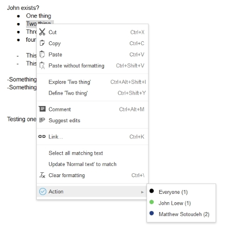

# docs-plus
A library for rich Google Docs extensions that can integrate with its editor.

[Skip to the Quickstart](#quickstart)

# Update
Apparently Google is [making significant changes to the Docs
editor](https://workspaceupdates.googleblog.com/2021/05/Google-Docs-Canvas-Based-Rendering-Update.html),
so this will likely stop working in the next few months.

# History
Docs+ was originally built for
[Action](https://web.archive.org/web/20170521022925/https://meetaction.com/),
an add-on that simplified action item tracking during Google Docs meetings,
about two years ago with [@adhivd](https://github.com/adhivd) and
[@wwilliamsshan](https://github.com/wwilliamsshan). Action no longer exists,
and I realize that (as far as I can tell) there isn't another good
Docs-integration library, so I figured someone else might find use in this part
of the Action code.

# License
All code in this repository is licensed under the MIT license.

If you're having trouble using any of the code (or doing anything with Docs,
particularly something Action used to do) feel free to reach out! I went
through a lot of trial and error with Action and might be able to point you in
the right direction.

# Demos/examples
- A test add-on ([manifest.json](manifest.json) and [test.js](test.js)) is
  included in this repository that acts as a set of usage examples and test
  cases for Docs+. Once loaded as a library in Chrome or Firefox, you can start
  the test by opening a Google Doc and typing ``alt+r``.
- Action was the origin of Docs+. It allows users to easily add action items to
  a shared 'follow-up list' that gets sent to all attendees by email after the
  meeting. It is deeply integrated with the editor, and does a great job of
  showing off what Docs-integrated extensions are capable of.
- [Speechless](https://github.com/matthewsot/speechless) uses the Docs+ library
  to predict time-to-speak for a user's selected text. This could be useful,
  for example, when writing a time-limited speech or presentation.
- [Docs-Vim](https://github.com/matthewsot/docs-vim) uses the Docs+ library to
  add a basic set of Vim keybindings to Google Docs.

# Quickstart
The test add-on can act as a template for using Docs+. Clone this repository,
then modify [manifest.json](manifest.json) and [test.js](test.js) to build your
add-on!

# Browser Support
Docs+ should support modern versions of Firefox and Chrome. Tested in Firefox
68.0.1 and Chrome 76.0.3809.100.

# Screenshots
Docs+ allows you to interact with the user's text in the Google Docs Kix
editor. A few screenshots of extensions using Docs+:

Rich interactions with the editor:

Adding custom buttons to Docs:

Using the user's selected text:

Interacting with Docs menus:

